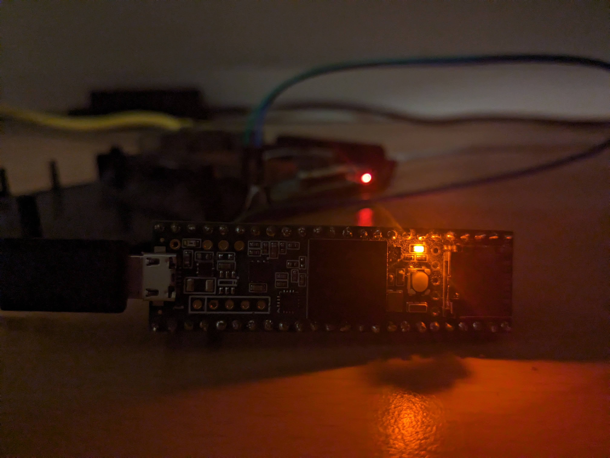
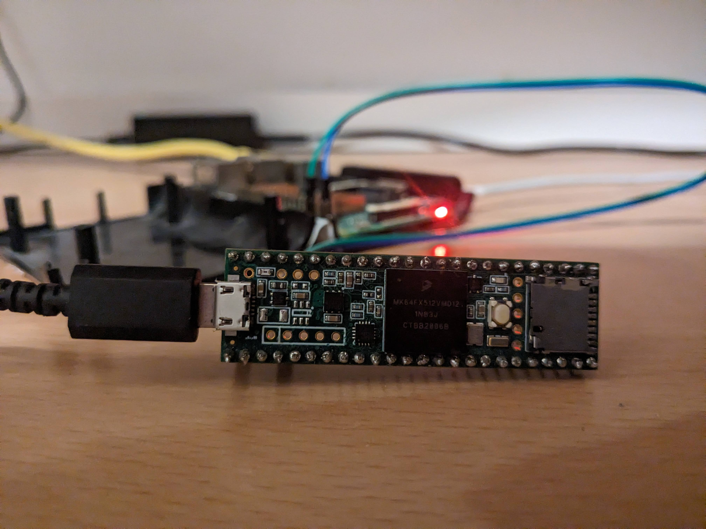

# Controlling GPIO on Raspberry Pi Using Shell Commands

## Everything is a File

In Unix systems, including the operating system on Raspberry Pi, a lot of things are treated as files. This includes not just typical files and directories but also devices and hardware interfaces. This principle allows us to interact with complex hardware by reading from and writing to simple file interfaces.

### GPIOchip
Modern Raspberry Pi OS versions use a block device-like structure for managing GPIOs, with each block represented as `gpiochip`. For instance, `gpiochip512` might represent a block starting at GPIO number 512 and containing a certain number of GPIO pins.

## Practical Example: GPIO Control via Command Line

> _NOTE_:  _`$`_ the default symbol for a user shell and it means that the command should be executed without root privileges. Same logic applies for _`#`_, the default symbol for a root shell.

### 1. Navigation to directory and review
GPIO hardware exposed in the file system under `/sys/class/gpio/` directory. Using `cd`, we can change directories:
```bash
$ cd /sys/class/gpio
```
We can list contents of this directory using `ls` :
```bash
$ ls
export  gpiochip512  gpiochip566  gpiochip568  unexport
```

### 2. Sysfs GPIO Values
Each `gpiochip` represents a block of GPIOs starting from a base offset. To control a specific GPIO using this interface, you will first need to calculate the actual GPIO number based on the gpiochip base and the relative pin number you wish to control.<br> Here, since gpiochip512 is the first chip and it handles 54 GPIOs starting from 512, to access the 3rd GPIO on this chip, you actually need to access GPIO 514 (512 + 2, since numbering starts from 0).


### 3. Exporting a GPIO Pin
To use a GPIO pin, it first needs to be made available (or "exported") for user-space applications:
```bash
echo 514 > /sys/class/gpio/export
```
### 4. GPIO File structure
```bash
$ cd gpio514
$ ls
active_low  device  direction  edge  power  subsystem  uevent  value
```
Among all these files, we are mainly interested in the `direction` and `value` files.

### 5. Setting GPIO Pin Direction
After exporting, set the pin as an output or input. Here, we set it to output:
```bash
$ echo out > direction
```

### 6. Writing to the GPIO Pin
Set the value of the GPIO pin:
```bash
$ echo 1 > value  # Set pin high, or
$ echo 0 > value  # Set pin low
```

### 7. Cleaning Up
Once done, unexport the pin to free up resources:
```bash
$ cd .. # Go up (back) one directory
$ echo 514 > unexport
```

## Scripting GPIO Control

To make control easier, we will write a Bash script that takes command-line arguments to turn the GPIO on or off.<br>
### Script will change `value` file depending on the `argument` it was executed with.
Let's get back to out home directory and create new folder with script inside:
```bash
$ mkdir switch && cd switch # MaKeDIRectory and ChangeDirectory into it
```
> _NOTE_:  `&&` will execute command after it only if previous one was completed successfully.

File can be created using `touch` :
```bash
$ touch switch.sh
```
Now we can edit file using `nano` text editor:
```bash
$ nano switch.sh
```
And paste or enter manually this script:
```bash
#!/bin/bash

# Path to the GPIO value file
FILE="/sys/class/gpio/gpio514/value"

# Check command line argument
if [ "$1" == "-on" ]; then
    echo "1" > $FILE  # Send 1 to file
elif [ "$1" == "-off" ]; then
    echo "0" > $FILE  # Send 0 to file
else
    echo "Usage: $0 -on or $0 -off"  # Show usage message
    exit 1
fi
```
> _NOTE_: `#!/bin/bash` is not a comment. It's a `shebang` - instruction for program what interpreter to use to run the script.

In nano, after finishing with the code, you can save (overwrite current) file using `CTRL+O` and agree to overwrite with the same file name (all this can be seen at the bottom of the screen).
### Making the Script Executable
For now, you will not be able to execute script, because there is no such permission on this file. You can check permission using `ls` with `-l` argument:
```bash
$ ls -l
total 4
-rw-r--r-- 1 user user 271 Apr 17 01:52 switch.sh
```
> _NOTE_: `rwx`-`rwx`-`rwx` format indicates: `file owner` - `other users in the owner group` - `other users`

Permission to execute in shown as `x` in `rwx` sequence. We can add this permission using `chmod` :
```bash
chmod +x switch.sh # CHangeMODe
```
After adding permission, we can check if it was actually assigned to file:
```bash
$ ls -l
total 4
-rwxr-xr-x 1 user user 271 Apr 17 01:52 switch.sh
```
Presence of an `x` indicates that now we are allowed to execute this file.

### Using the Script
To turn the GPIO on or off:
```bash
./switch.sh -on
./switch.sh -off
```
If arguments were not specified, script will show "help page".

### Observing the Results
To check the current state of the GPIO:
```bash
cat /sys/class/gpio/gpio514/value
```
In my case, the indicator was an LED on the Teensy board.
1             |  0
:-------------------------:|:-------------------------:
  |  
